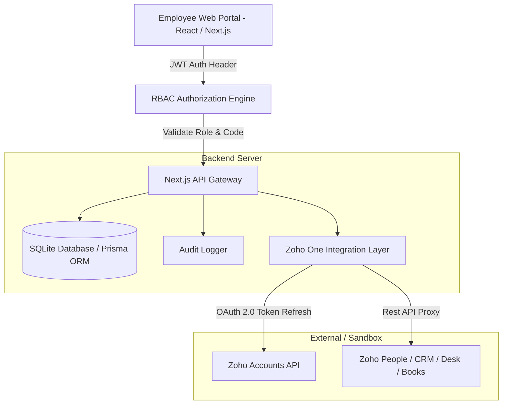

# Custom Employee Portal with Zoho One Integration

> Enterprise-grade web-based Custom Employee Portal built with **Next.js 14 (App Router)**, **TypeScript**, **Tailwind CSS**, **Prisma ORM**, **SQLite**, **JWT Authentication**, and **Role-Based Access Control (RBAC)** integrated with **Zoho One REST APIs**.

---

## 🚀 Key Features

- 🔐 **Custom Authentication System**: JWT token-based authentication with encrypted password hashing (`bcryptjs`) and cookie/header token management.
- 🛡️ **Comprehensive Role-Based Access Control (RBAC)**:
  - **Admin**: Full system access, User Management, Role & Permission Matrix editor, Audit Logging, Zoho API Config.
  - **HR**: Access restricted to **Zoho People** (Employee management, leave balances, clock-in).
  - **Sales**: Access restricted to **Zoho CRM** (Sales pipeline, lead qualification, deal stages).
  - **Support**: Access restricted to **Zoho Desk** (Customer support tickets, CSAT scores, SLA tracking).
  - **Finance**: Access restricted to **Zoho Books** (Invoices, expense tracking, revenue analytics).
  - **Manager**: Department management, team analytics, assigned functions.
- 🌐 **Zoho One API Integration Layer**:
  - Backend proxy service handling OAuth 2.0 token refreshes securely.
  - Employees do NOT require individual Zoho credentials.
  - Dual Mode: Runs out-of-the-box in **Sandbox Mock Mode** (zero external dependencies required), and automatically switches to **Live Zoho REST APIs** when OAuth credentials are provided in `.env`.
- 📋 **Audit Logging & Activity Tracking**: Real-time logging of user logins, policy enforcement, admin changes, and Zoho API calls.
- ⚡ **Pre-Seeded Demo Database**: Includes instant one-click login presets for all roles.

---

## 👥 Pre-Seeded Demo Credentials

| Role | Email | Password | Authorized Zoho Service |
| :--- | :--- | :--- | :--- |
| **Admin** | `admin@company.com` | `admin123` | **Full Access** + All Zoho Apps + Admin Controls |
| **HR** | `hr@company.com` | `hr123` | **Zoho People** |
| **Sales** | `sales@company.com` | `sales123` | **Zoho CRM** |
| **Support** | `support@company.com` | `support123` | **Zoho Desk** |
| **Finance** | `finance@company.com` | `finance123` | **Zoho Books** |
| **Manager** | `manager@company.com` | `manager123` | **Zoho People** + **Zoho CRM** |

---

## 📐 Architecture & Data Flow



---

## 🔑 RBAC Permission Matrix

| Permission Code | Category | Purpose | Admin | HR | Sales | Support | Finance | Manager |
| :--- | :--- | :--- | :---: | :---: | :---: | :---: | :---: | :---: |
| `access:zoho_people` | Zoho | HR & Employee Directory | ✅ | ✅ | ❌ | ❌ | ❌ | ✅ |
| `access:zoho_crm` | Zoho | Sales Deals & Leads | ✅ | ❌ | ✅ | ❌ | ❌ | ✅ |
| `access:zoho_desk` | Zoho | Support Tickets & Desk | ✅ | ❌ | ❌ | ✅ | ❌ | ❌ |
| `access:zoho_books` | Zoho | Financial Books & Invoices | ✅ | ❌ | ❌ | ❌ | ✅ | ❌ |
| `manage:users` | Admin | Create/Edit/Delete Users | ✅ | ❌ | ❌ | ❌ | ❌ | ❌ |
| `manage:roles` | Admin | Manage Roles & Permissions | ✅ | ❌ | ❌ | ❌ | ❌ | ❌ |
| `view:audit_logs` | Admin | View Security Audit Logs | ✅ | ❌ | ❌ | ❌ | ❌ | ❌ |

---

## ⚙️ Quick Start Installation

### Prerequisites
- **Node.js**: v18.0.0 or higher
- **npm**: v9.0.0 or higher

### Steps

1. **Clone / Unzip project repository**:
   ```bash
   cd custom-employee-portal
   ```

2. **Install dependencies**:
   ```bash
   npm install
   ```

3. **Initialize & Seed SQLite Database**:
   ```bash
   npx prisma db push
   npx prisma db seed
   ```

4. **Run Development Server**:
   ```bash
   npm run dev
   ```

5. **Access Application**:
   Open browser at `http://localhost:3000`. Use any of the pre-seeded credentials above or one-click demo presets on the login screen.

---

## 🛠️ Environment Configuration (`.env`)

```env
DATABASE_URL="file:./dev.db"
JWT_SECRET="brainwave_custom_employee_portal_jwt_secret_key_2026"
PORT=3000

# Optional: Live Zoho One API OAuth Credentials
ZOHO_ACCOUNTS_URL="https://accounts.zoho.com"
ZOHO_CLIENT_ID=""
ZOHO_CLIENT_SECRET=""
ZOHO_REFRESH_TOKEN=""
ZOHO_ORG_ID=""
```

---

## 🧪 Verification & Building

To verify and test production build:
```bash
npm run build
npm start
```
